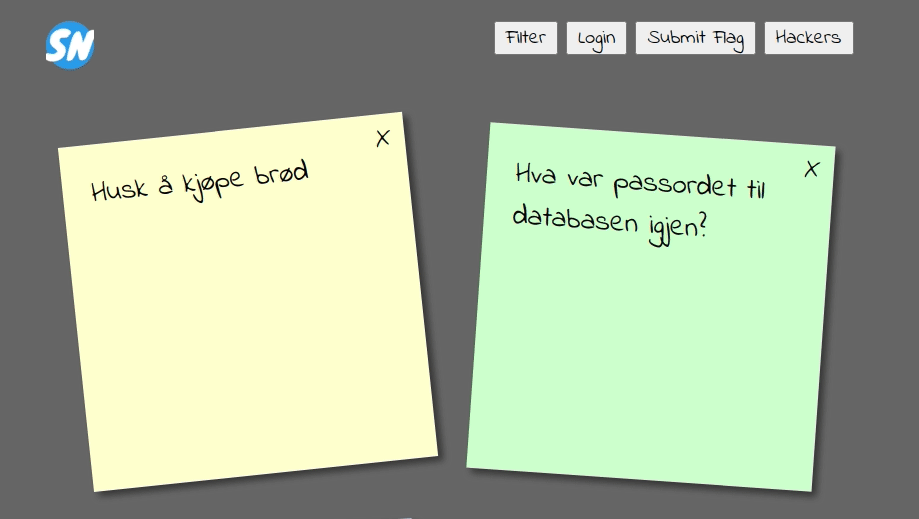

Introduction
============
_Welcome! In this workshop we aim to cover common security vulnerabilities you might encounter as an application developer. Many of the vulnerabilities are adapted from the famous [top 10 web application security risks](https://owasp.org/Top10/), published by the Open Web Application Security Project ([OWASP](https://owasp.org/)). We've chosen to focus on the vulnerabilities that most developers could face, even if they don't work on security critical components, like authentication providers, network infrastructure, and so on._

The Fault, the Fix and the Flag
-------------------------------
Most sections contain three parts:
* __The Fault:__ In this part you're introduced to a security vulnerability, and are guided through the steps needed to exploit that vulnerability on the version of Sticky Notes running on your machine. The goal is to make you familiar with how this exploit works, and give you some hands on experience running it.
* __The Fix:__ In this part you'll fix the security vulnerability in Sticky Notes locally on your machine. Here you'll see an example of unsecure code, and how it could be rewritten to remove the security issue. In order to make the example easy to understand, the code is usually quite banal. Therefore it can be useful to reflect on how the same problem could appear in a more production-like setting.
* __The Flag:__ This part is optional, but if you want a challenge, you can hunt from flags using the exploit covered by the given section. You'll hunt for flags in [the online version of Notes.Client](https://sticky-notes.eu.ngrok.io/client/) and [Notes.Api](https://sticky-notes.eu.ngrok.io/swagger/index.html).

### Where do I hunt for flags?
Most flags are found in [the online version of Notes.Client](https://sticky-notes.eu.ngrok.io/client/). Except for for the first flag, don't look for flags in you local version. You won't find them there.

Apart from containing flags, the online version of Sticky Notes behaves just like your local version, so any attack that works locally, should work online.

_Happy hunting!_

### How to submit found flags
When you've found a flag, you can submit it in [the online version of Notes.Client](https://sticky-notes.eu.ngrok.io/client/). Just press the "Submit Flag" button, fill out your name, the flag, and select the challenge. You'll know if your answer is correct or not.

You can keep track of how many flags you've found by viewing the "Top Hackers" highscore.

Security vulnerabilities
------------------------
_These are the vulnerabilities that we'll be working with. Start with the first one, or pick a topic that intrusts you, and go from there._

1. [Sensitive Data Exposure](1_SENSITIVE_DATA_EXPOSURE.md)
2. [Broken Access Control](2_BROKEN_ACCESS_CONTROL.md)
3. [Cross Site Scripting](3_CROSS_SITE_SCRIPTING.md)
4. [SQL Injection](4_SQL_INJECTION.md)
5. [Insecure Deserialization](5_INSECURE_DESERIALIZATION.md)
