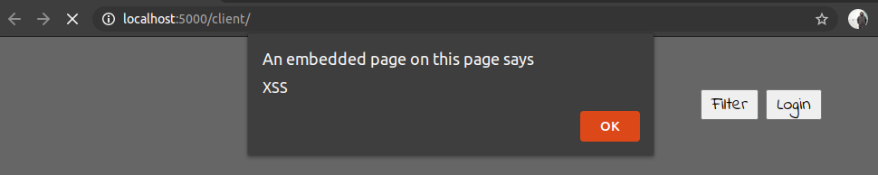
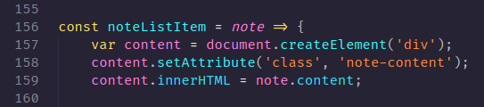
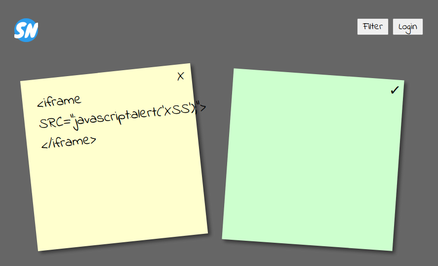

3 Cross Site Scripting (XSS)
============================
[Cross Site Scripting](https://owasp.org/www-project-top-ten/OWASP_Top_Ten_2017/Top_10-2017_A7-Cross-Site_Scripting_(XSS)), or XSS as it's commonly called, is an attack where the attacker makes our webpage run some JavaScript that we didn't intend it to run. XSS attacks commonly follow three steps:
1. The attacker crafts a special comment, blog post or sticky note, containing some special HTML, CSS and JavaScript.
2. Our page saves the data as usual, but when loading it back up again, the webpage gets confused, and ends up running the JavaScript that the attacker included.
3. An unsuspecting user views the comment, blog post or sticky note that the attacker created, triggering the injected JavaScript in their browser. From here the attacker can do all sort of nasty things.

A problem with protecting a site from XSS attacks, is that HTML, CSS and JavaScript contains a lot of different features, enabling injection attacks to take many different forms. OWASP has a [XSS Filter Evasion Cheat Sheet](https://owasp.org/www-community/xss-filter-evasion-cheatsheet) that illustrates some of the ways an attacker can change their code to evade attempts to protect a site from XSS attacks.

The Fault
---------
Sticky Notes has an XSS vulnerability. When displaying sticky notes, it can easily be confused into running malicious JavaScript.

HTML let's us embed JavaScript by using the `<script>`-tag, so a simple attack can use this to confuse our webpage. Create a new note containing the following script-tag and reload Notes.Client.
```html
<script>alert("XSS");</script>
```

Hmm, we got a blank note, but apart from that nothing much happened. Why is that? Since cross site scripting is such a huge problem, the browser vendors tries to prevent the most basic XSS attacks. In this case, our browser recognized that our `<script>`-tag is probably an attempt at cross site scripting, and chose not to execute the contained JavaScript.

Lets try a more obfuscated approach. The following uses the `onload`-attribute on the `<svg>`-tag, alone with some additional obfuscation, to run `alert('XSS')` when the page loads.
```html
<svg/onload=alert('XSS')>
```

If the svg-trick didn't work, we can move on to using an iframe-based attack. Did you know that you can set JavaScript as a source for iframes, images, stylesheets and so on?
```html
<iframe src="javascript:alert('XSS');"></iframe>
```

If this didn't work, you can continue to try examples from the [XSS Filter Evasion Cheat Sheet](https://owasp.org/www-community/xss-filter-evasion-cheatsheet) until you find one attack that works for your browser. When the attack is successful, you should end up with an alert looking like this:



The Fix
-------
A lot of issues are enabling this XSS attack. We could for instance probably do a better job validating the content of the notes we store to the database. But one issue is especially significant, when displaying the sticky notes returned from Notes.Api, we're using the `innerHTML`-property to add the note content to the DOM element containing the sticky note.

Instead of using `innerHTML` to display text, we should have been using `innerText`, to signal to the browser that anything we supply should be displayed as text. To fix this, we can open [Notes.Client/script.js](../Notes.Client/script.js) and edit `noteListItem` so we use `innerText` instead of `innerHTML`.



_In other words, replace line 159 with the following._

```javscript
content.innerText = note.content;
```
Now we should have avoided the XSS attack, and the note should display the nefarious content as text, for all to see.



_Usually we'll be using a web framework like React or Angular that'll be handling manipulating DOM-elements. These frameworks also tries to avoid XSS vulnerabilities by controlling how our code is able to interact with the DOM. This fortunately makes successful XSS attacks more rare, but we should still test for them, and make sure to keep our web framework up to date with the latest security fixes._

The Flag
--------

