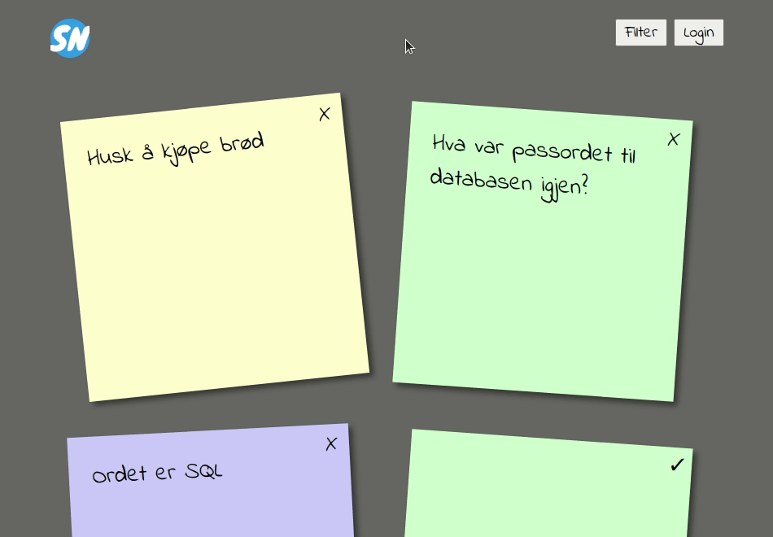

4 SQL Injection
===============
[Injection](https://owasp.org/www-project-top-ten/OWASP_Top_Ten_2017/Top_10-2017_A1-Injection) is the top vulnerability on OWASP Top 10. It's similar to XSS, in that we target the application by giving it some malicious data, containing code we intend to trick the application into running. The big difference is that we're targeting the backend systems, and they usually have direct access to all the data our application contains.

Injection attacks can be performed by injecting many different kinds of code, but injection attacks using SQL-code is particularly infamous. In this section we're going to explore one such attack.

The Fault
---------
Sticky Notes allows the user to filter their notes by using the filter button in the upper right corner. When using the filter, you supply some text, and then Notes.Client will filter your sticky notes, so you only see notes containing that text.



Let's have a look at how this filter functionality is implemented. Notes.Client supplies the text the notes should contain to Notes.Api, where it is sent to `public Note[] Get([FromQuery] string containing)` in [Notes.Api/Controllers/NotesController.cs](../Notes.Api/Controllers/NotesController.cs) as the input variable `containing`. If we take a look at how the function is implemented, we see that it uses `containing` to construct a SQL-query to retrieve the notes.
```csharp
return _database.Notes
    .FromSqlRaw($"SELECT * FROM Notes WHERE Author='{user.Username}' AND Content LIKE '%{containing}%' ORDER BY Id")
    .ToArray();
```

Lets say you're the user "Test", and you filtered on "SQL", then the SQL-query sent to the database would be:
```SQL
SELECT * FROM Notes WHERE Author='Test' AND Content LIKE '%SQL%' ORDER BY Id
```

Unfortunately, this leaves a gaping security hole in our application. Lets for instance say you know there's another user named "Louise Robinson", and you choose to filter on the text "%' OR Author LIKE '%Louise Robinson". Now the SQL-query executed by the database would be:
```SQL
SELECT * FROM Notes WHERE Author='Test' AND Content LIKE '%%' OR Author LIKE '%Louise Robinson%' ORDER BY Id
```

This would return every note written by the user "Test" and any user with a username containing "Louise Robinson". Find the username for a user in your database, for instance by exploiting the broken access control issue in [0_BROKEN_ACCESS_CONTROL](0_BROKEN_ACCESS_CONTROL.md), and try it for yourself.


But we can do one better, since `LIKE '%%'` matches any string, we can retrieve all notes written by any user by using the filter "%' OR Author LIKE '%".

The Fix
-------
The fix for SQL injection is usually to use prepared SQL-statements, something that an [ORM](https://en.wikipedia.org/wiki/Object-relational_mapping) like [Entity Framework Core](https://docs.microsoft.com/en-us/ef/core/) can help us with. Let's go back to `public Note[] Get([FromQuery] string containing)` in [Notes.Api/Controllers/NotesController.cs](../Notes.Api/Controllers/NotesController.cs), and re-implement it in a way that's not susceptible to SQL injection attacks.

```csharp
return _database.Notes
    .Where(note => note.Author == user.Username)
    .Where(note => string.IsNullOrEmpty(containing) ? true : note.Content.Contains(containing))
    .OrderBy(note => note.Id)
    .ToArray();
```

Instead of using raw SQL that we construct ourselves, we use Linq statements, and rely on the built-in SQL translator in Entity Framework to convert our expression into SQL executed by the database. Test it out and check that it solves the problem.

The Flag
--------
