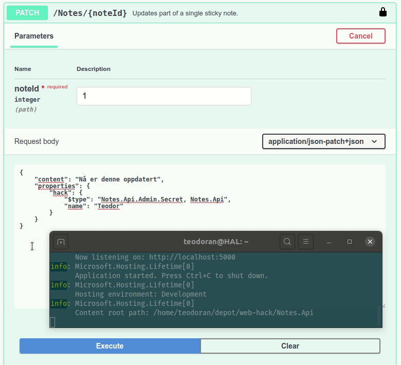

5 Insecure Deserialization
==========================
Deserialization is not an easy task. You need to take a data-interchange format like JSON, and turn it into a bunch of running code, usually by instantiating some objects, filling in some properties and so on. The fundamental problem is that the programming language you're trying to deserialize into, is usually more expressive than the data-interchange format you're deserializing from. To solve this we ended up with serializers that can encode programming language features encoded as serialized data, and on the way we left the door open for deserialization attacks.

Insecure Deserialization is part of a [large category og software and data integrity failures](https://owasp.org/Top10/A08_2021-Software_and_Data_Integrity_Failures/), and it works by exploiting features in different serialization libraries like [Json.Net and Jackson](https://www.blackhat.com/docs/us-17/thursday/us-17-Munoz-Friday-The-13th-JSON-Attacks-wp.pdf). The attacks are usually different for each library, but they all result in an attacker being able to execute code that we didn't intend anyone but ourselves to be executing. This enable attackers to wreak havoc on our servers.

The Fault
---------
Since Notes.Api is written in .NET, we're going to [target deserialization in the popular library Json.NET](https://www.alphabot.com/security/blog/2017/net/How-to-configure-Json.NET-to-create-a-vulnerable-web-API.html). Lets start by opening Swagger UI and taking a look at PATCH /Notes/{noteId}.

The PATCH endpoint accepts dictionary (hash map) of properties. If we dig deeper into the class representing the data accepted by this endpoint, by viewing [Notes.Api/Models/UpdateNote.cs](../Notes.Api/Models/UpdateNote.cs), we can see that the dictionary can contain any kind of object. We probably anticipate that we're going to need some kind of data in addition to the note content in the future, and by using a dictionary, we wont be needing to change `UpdateNote` when that happens.

```csharp
public class UpdateNote
{
    [Required]
    [MinLength(1)]
    [MaxLength(500)]
    public string Content { get; set; }

    public Dictionary<string, object> Properties { get; set; }
}
```

This is a situation that can be exploited. Bring up the terminal running your instance of Note.Api alongside Swagger UI. Then pick a random note ID, and PATCH it with the following JSON, replacing "Teodor" with your name.
```json
{
    "content": "Nå er denne oppdatert",
    "properties": {
        "hack": {
            "$type": "Notes.Api.Admin.Secret, Notes.Api",
            "name": "Teodor"
        }
    }
}
```

Observe how this request makes Notes.Api print "Access granted". How did this happen?



To understand how this attack works, we first must understand what Json.NET does when it serialize and deserialize properties with an indeterminate type like `object`. Depending on how [TypeNameHandling](https://www.newtonsoft.com/json/help/html/T_Newtonsoft_Json_TypeNameHandling.htm) is configured, Json.NET will produce and read a property named "$type", containing information about the class that should be used for deserializing a given section in the JSON document. Usually "$type" is set by Json.NET to be one of the types that we expect an property to have, but in principle Json.NET will accept any type, and try to deserialize it.

We can exploit this to execute code as a side effect of instantiating [Notes.Api/Admin/Secret.cs](../Notes.Api/Admin/Secret.cs). If we have a look at this class, we see that setting the "Name" property will print some text to the console.
```csharp
public string Name
{
    get => "Not really important";
    set => Console.WriteLine($"Access granted {value}");
}
```

When given `"$type": "Notes.Api.Admin.Secret, Notes.Api"` and `"name": "Teodor"` as part of the JSON to serialize, Json.NET will then create a new instance of the `Secret` class, and call the setter for the property "Name", thereby printing "Access granted" to the console.

_You might never perform side effects in constructors and setters, but what about the classes present in your libraries? Classes like `System.IO.FileInfo` that would give you information about the files on the server, classes like `System.Configuration.Install.AssemblyInstaller` that could execute code and load local assemblies, or classes like `System.Windows.Data.ObjectDataProvider` that could invoke arbitrary methods._

The Fix
-------
An obvious fix to this problem would to not rely on accepting a dictionary of objects, but let's pretend that we cannot change how our data is represented, and take a look at how [TypeNameHandling](https://www.newtonsoft.com/json/help/html/T_Newtonsoft_Json_TypeNameHandling.htm) is configured in [Notes.Api/Program.cs](../Notes.Api/Program.cs).

If we have a look at how the JSON serializer is configured in `.AddNewtonsoftJson(...)`, we can see that TypeNameHandling is configured as `TypeNameHandling.Auto`. This enables the Json.NET features that we're exploiting.

```csharp
builder.Services
    .ConfigureSecrets(builder.Configuration)
    .AddControllers()
    .AddNewtonsoftJson(options =>
    {
        options.SerializerSettings.TypeNameHandling = TypeNameHandling.Auto;
        options.SerializerSettings.Converters.Add(new StringEnumConverter());
    });
```

The only truly safe option for TypeNameHandling is `TypeNameHandling.None`, and by updating Notes.Api to use this, we should have plugged this security hole.
```csharp
options.SerializerSettings.TypeNameHandling = TypeNameHandling.None;
```

Try the same exploit again after updating Notes.Api. This time we shouldn't get any "Access granted" printet to the terminal.

The Flag
--------
There's a flag hiding somewhere in Notes.Api that can be retrieved using a deserialization attack. Can you find it? Once again you might want to use a service like [requestbin.com](https://requestbin.com/r) to create a quick API endpoint.