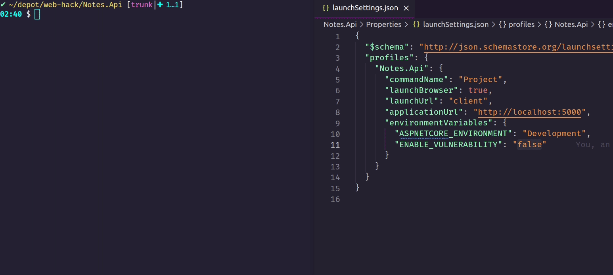

6 Vulnerable and Outdated Components
====================================
Who doesn't love packages? They make our life easier by often supplying well-engineered and tested solutions to common problems. Unfortunately, relying on packages makes us increasingly susceptible to [vulnerable and outdated components](https://owasp.org/Top10/A06_2021-Vulnerable_and_Outdated_Components/).

When going after out packages, two common attack vectors are either to exploit vulnerabilities in an existing package, or to make us use a fake alternative without us knowing.

Vulnerabilities in existing packages are usually introduced due to programmer oversight, but can also be introduced beforehand by the attacker, perhaps disguised as a helpful bugfix. A famous example of this was the recent [Log4Shell](https://nvd.nist.gov/vuln/detail/CVE-2021-44228) debacle, where a critical vulnerability was discovered in a widely used logging framework. Although not 100% foolproof, automatically scanning your dependencies for versions with known vulnerabilities, goes a long way to remedy this issue. A common tool for such scanning is [Dependabot](https://docs.github.com/en/code-security/supply-chain-security/managing-vulnerabilities-in-your-projects-dependencies/about-alerts-for-vulnerable-dependencies) used by GitHub. Beeing vigilant about updating packages, is also a good precaution.

Avoiding fake impostor packages can be harder, as they can be introduced at several points in the development pipeline. An attacker could for instance exploit weaknesses in package version resolution through [dependency confusion](https://medium.com/@alex.birsan/dependency-confusion-4a5d60fec610), as was successfully performed against Apple and Microsoft. Another option could be to target the build systems, injecting fake packages directly to the build server.

In this section, we'll examine a [typosquatting](https://incolumitas.com/2016/06/08/typosquatting-package-managers/) attack, where an attacker exploits our human ability to misspell words, in order to serve us fake packages.

The Fault
---------
It may be surprising, but Notes.Api comes with a build in vulnerability related to impostor packages. Usually it's hiding, waiting for an opportunity to strike while we're not looking, but by being versed in the arcane arts of environment variable manipulation, you too can lure it out from the shadows.

An easy option to control environment variables during .NET development, is to use a launch-setting file. Open [Notes.Api/Properties/launchSettings.json](../Notes.Api/Properties/launchSettings.json) and update the environment variable `ENABLE_VULNERABILITY` from `false` to `true`. Then restart Notes.Api.

```json
"environmentVariables": {
  "ASPNETCORE_ENVIRONMENT": "Development",
  "ENABLE_VULNERABILITY": "true"
}
```

_**NB:** Notes.Api must be fully restarted in order for it to read the new updated environment variable. Just triggering a reload with `dotnet watch` is not enough._



_"VULNERABILITY ENABLED"?! What happened here?_

We can dig all we want in Notes.Api, but we won't find the guilty code in this repository. Before we leave though, lets have a quick look at the `Content` function in [Notes.Api/Database/GenerateRandom.cs](../Notes.Api/Database/GenerateRandom.cs).

```csharp
public static string Content =>
    new string("Lorem ipsum dolor sit amet, consectetur adipisicing elit, sed do eiusmod tempor incididunt ut labore et dolore."
        .Take(Random.Next(5, 100))
        .ToArray());
```

Seems like nothing strange is going on here. Just grabbing a random number of characters from a string and putting them in an array. Surprisingly `.ToArray()` is actually the source of the message!

When working with .NET, one option is to declare dependencies in the project file. For Notes.Api, this file is [Notes.Api/Notes.Api.csproj](/home/teodoran/depot/web-hack/Notes.Api/Notes.Api.csproj). Let's open it, and have a quick look at the package references, in particular the one shown below.

```xml
<PackageReference Include="Swashbukle.AspNetCore" Version="2.0.0" />
```

[Swashbuckle.AspNetCore](https://www.nuget.org/packages/Swashbuckle.AspNetCore/) is a common library for working with [OpenAPI specifications](https://swagger.io/specification/), but [Swashbukle.AspNetCore](https://www.nuget.org/packages/Swashbukle.AspNetCore/) isn't. It's an impostor package!

Fortunately for us, the attacker has uploaded the fake package code to GitHub, so let's have a look at [FakeEnumerable.cs](https://github.com/elliot-mitnick-alderson/swashbukle/blob/main/Swashbukle.AspNetCore/FakeEnumerable.cs), the source of our problems.

```csharp
namespace System.Linq;

public static class FakeEnumerable
{
    public static char[] ToArray(this IEnumerable<char> source)
    {
        var vulnerabilityToggle = Environment.GetEnvironmentVariable("ENABLE_VULNERABILITY");
        if (bool.TryParse(vulnerabilityToggle, out var enabled) && enabled)
        {
            Console.WriteLine($"VULNERABILITY ENABLED");
        }

        return System.Linq.Enumerable.ToArray(source);
    }
}
```

This pice of code does three particularly interesting things. Firstly it masquerades as being part of the namespace `System.Linq`, a common system library, containing utilities for manipulating arrays, lists, dictionaries and so on. This masquerade makes the .NET compiler include the code in every file in Notes.Api that uses functionality from `System.Linq`.

Secondly the code abuses [operator overloading](https://docs.microsoft.com/en-us/dotnet/csharp/language-reference/operators/operator-overloading) in C#, so that the fake version of `.ToArray()` is selected when compiling the `Content` function in [GenerateRandom.cs](../Notes.Api/Database/GenerateRandom.cs).

Finally, the fake `.ToArray()` uses the real version from `System.Linq.Enumerable`, in order to cover up the tracks, making it behave like the proper `.ToArray()` for anyone that uses it.

The Fix
-------
In this case the fix is quite easy. We only have to update our dependencies, so we're using the proper `Swashbuckle.AspNetCore` package. Let's update [Notes.Api/Notes.Api.csproj](/home/teodoran/depot/web-hack/Notes.Api/Notes.Api.csproj) with the proper package dependency shown below:

```xml
<PackageReference Include="Swashbuckle.AspNetCore" Version="6.2.3" />
```

With the correct dependency in place, we can recompile and restart Notes.Api to get rid of alle the "VULNERABILITY ENABLED"-messages.

The Flag
--------
`Swashbukle.AspNetCore` wasn't the only fake package used by Notes.Api. Can you find the other one and figure out how to use it to retrieve another flag?