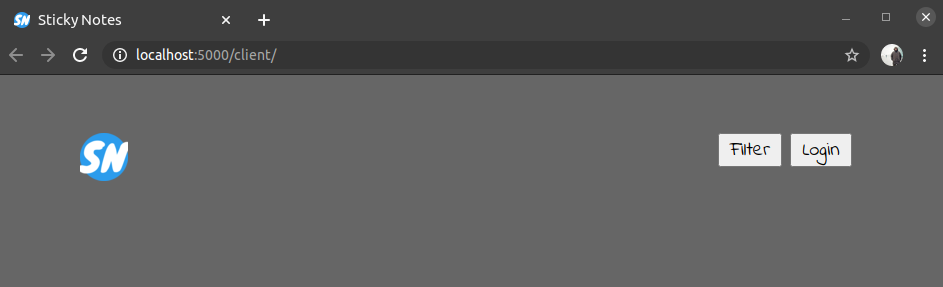
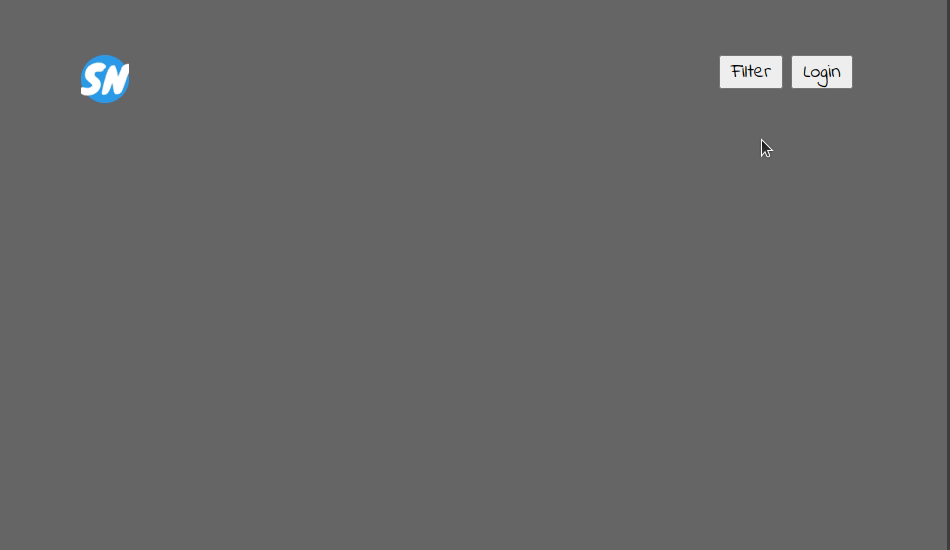
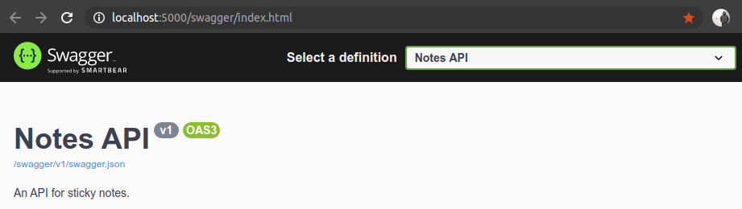

Sticky Notes
============
_The best-of-breed cloud-based sticky note solution. Obviously not containing any security risks. To compete in the intertwingled world of tomorrow, we at Sticky Software Solutions™ are committed to delivering the best-of-breed cloud-based sticky note solution._

Getting started
---------------
In order to work on Sticky Notes, you'll need the [.NET 6.0 SDK](https://dotnet.microsoft.com/en-us/download), and your favorite code-editing tool. If you have no prior tool preference, [Visual Studio Code](https://code.visualstudio.com/) with the [C# extension](https://marketplace.visualstudio.com/items?itemName=ms-dotnettools.csharp) is recommended, as this incurs no extra cost to _Sticky Software Solutions™_, thus preserving shareholder dividends next quarter.

### Cloning, building and running
Start by cloning this repo. Then navigate into the `web-hack/Notes.Api/` folder and start the application with `dotnet watch run`:
```shell
$ web-hack/Notes.Api> dotnet watch run
watch : Hot reload enabled. For a list of supported edits, see https://aka.ms/dotnet/hot-reload. Press "Ctrl + R" to restart.
watch : Building...
  Determining projects to restore...
  All projects are up-to-date for restore.
  Notes.Api -> /web-hack/Notes.Api/bin/Debug/net6.0/Notes.Api.dll
watch : Started
info: Microsoft.Hosting.Lifetime[14]
      Now listening on: http://localhost:5000
info: Microsoft.Hosting.Lifetime[0]
      Application started. Press Ctrl+C to shut down.
info: Microsoft.Hosting.Lifetime[0]
      Hosting environment: Development
info: Microsoft.Hosting.Lifetime[0]
      Content root path: /web-hack/Notes.Api
Opening in existing browser session.

```

This should restore dependencies, build and start Notes.Api. Since we're using `watch`, Notes.Api should be recompiled and restarted whenever we change one of the source files in the /Notes.Api folder.

### Opening Notes.Client
Notes.Client is a static website, and it's hosted by Notes.Api. To open it, visit [localhost:5000/client](http://localhost:5000/client).



Initially, it won't show much, since we're currently not logged on to the Sticky Notes application. To logon, you'll need to press the "Login" button in the upper right corner, and enter a valid username and password.



_Note: If you're using Firefox and have trouble logging in, you have to enable HTML `<dialog>`-element. This feature is behind the dom.dialog_element.enabled preference (needs to be set to true). To change preferences in Firefox, visit about:config._

### Working with Notes.Api in Swagger UI
You can access Notes.Api directly through [Swagger UI](https://swagger.io/tools/swagger-ui/). This gives you the option to craft requests and send them directly to the API, without using Notes.Client. To open Swagger UI, visit [localhost:5000/swagger](http://localhost:5000/swagger).



In order to make any requests to the API, you first need to authorize, using av valid username and password. To authorize, press the "Authorize" button, and enter a valid username and password.


### Ready for some hacking?
With everything set up and working properly, you're ready to start on the workshop. The workshop is divided into sections under the /Documents folder. Start by navigating to [0_INTRODUCTION.md](Documents/0_INTRODUCTION.md), and go on from there.
