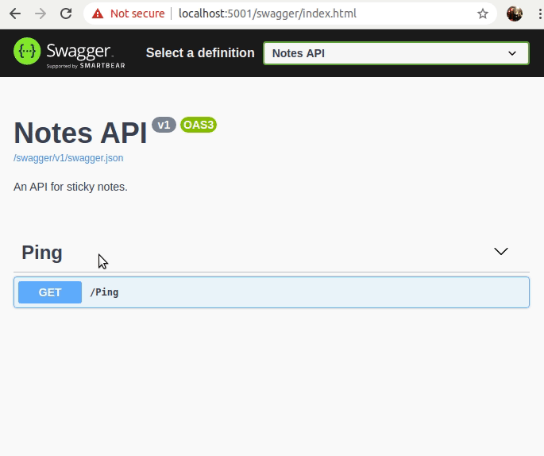

Web Hack
========
_Hacking workshop focusing on OWASP top 10 web security risks._

In this workshop we'll work on hacking the Sticky Notes website. More information about this website is shown below.


Sticky Notes
============
_The best-of-breed cloud-based sticky note solution._


Getting started
---------------

### Where to find the sticky notes?

| Environment   | Notes.Client                                                                                         | Notes.Api                                                                                                                          |
| ------------- | ---------------------------------------------------------------------------------------------------- | ---------------------------------------------------------------------------------------------------------------------------------- |
| Test          | [https://stickynotestest.z6.web.core.windows.net/](https://stickynotestest.z6.web.core.windows.net/) | [https://sticky-notes-api-test.azurewebsites.net/swagger](https://sticky-notes-api-test.azurewebsites.net/swagger) |
| Prod          | [https://stickynotes.z6.web.core.windows.net/](https://stickynotes.z6.web.core.windows.net/)         | [https://sticky-notes-api.azurewebsites.net/swagger](https://sticky-notes-api.azurewebsites.net/swagger)           |

### Installation
You'll need the following tools to get started:
* [Git](https://git-scm.com/downloads)
* [.NET Core SDK 3.1 or later](https://dotnet.microsoft.com/download)

In addition you'll need a tool for editing C# code. [VS Code](https://code.visualstudio.com/download) with the [C# extension](https://marketplace.visualstudio.com/items?itemName=ms-vscode.csharp) is a nice option.

### Cloning, building and testing
Start by cloning this repo. Then navigate into the `sticky-notes/Notes.Api/` folder and start the application with `dotnet run`:
```shell
$ sticky-api/Notes.Api> dotnet run
```

Open your favorite browser, and navigate to [localhost:5001/swagger](https://localhost:5001/swagger). This should open [Swagger UI](https://swagger.io/tools/swagger-ui/), where you can try out the API.



If you want to run the tests, navigate into the `sticky-notes/Notes.Api.Test/` folder and run `dotnet test`:
```shell
$ sticky-notes/Notes.Api.Test> dotnet test
```

The client can be served locally by serving the contents from `Notes.Client` with a suitable static server:
```shell
$ sticky-notes/Notes.Api.Client> python -m SimpleHTTPServer
```
